# Smart School v7.1.0 - Entity Relationship Diagram

## Overview
This document presents the complete Entity-Relationship (ER) diagram for the Smart School Management System. The database consists of **~135 tables** organized into functional modules.

---

## 📊 Visual ER Diagram (Mermaid Format)

### Core Student & Academic Module

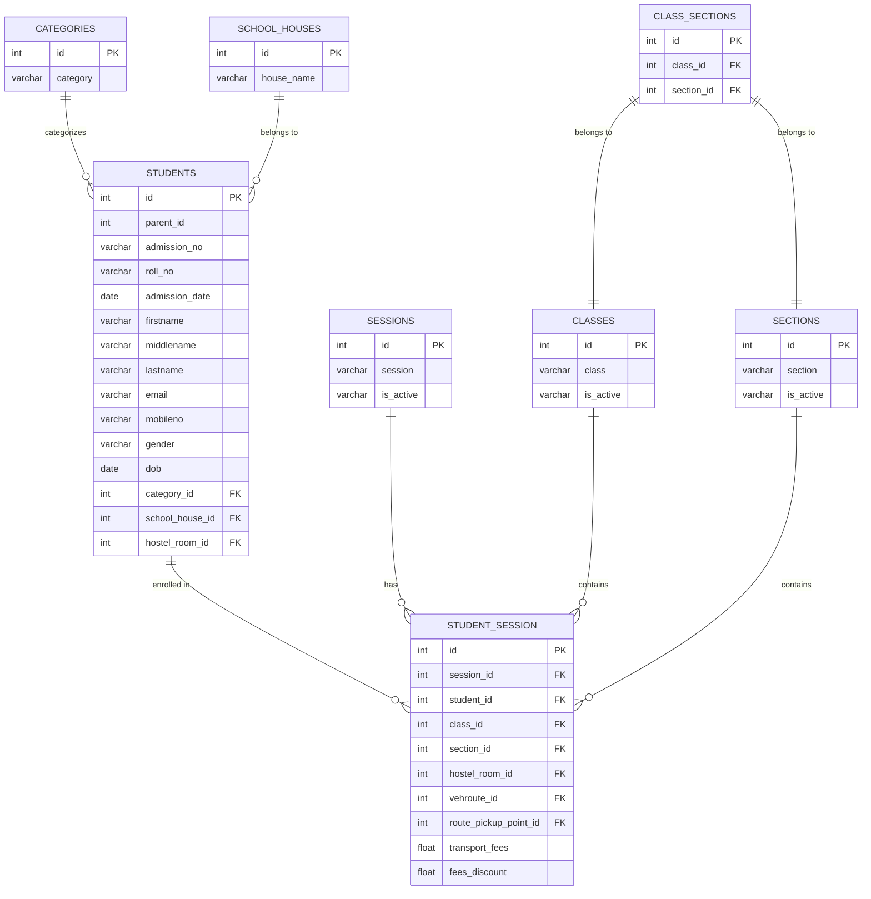
```mermaid
erDiagram
    STUDENTS ||--o{ STUDENT_SESSION : "enrolled in"
    SESSIONS ||--o{ STUDENT_SESSION : "has"
    CLASSES ||--o{ STUDENT_SESSION : "contains"
    SECTIONS ||--o{ STUDENT_SESSION : "contains"
    
    STUDENTS {
        int id PK
        int parent_id
        varchar admission_no
        varchar roll_no
        date admission_date
        varchar firstname
        varchar middlename
        varchar lastname
        varchar email
        varchar mobileno
        varchar gender
        date dob
        int category_id FK
        int school_house_id FK
        int hostel_room_id FK
    }
    
    STUDENT_SESSION {
        int id PK
        int session_id FK
        int student_id FK
        int class_id FK
        int section_id FK
        int hostel_room_id FK
        int vehroute_id FK
        int route_pickup_point_id FK
        float transport_fees
        float fees_discount
    }
    
    SESSIONS {
        int id PK
        varchar session
        varchar is_active
    }
    
    CLASSES {
        int id PK
        varchar class
        varchar is_active
    }
    
    SECTIONS {
        int id PK
        varchar section
        varchar is_active
    }
    
    CLASS_SECTIONS ||--|| CLASSES : "belongs to"
    CLASS_SECTIONS ||--|| SECTIONS : "belongs to"
    
    CLASS_SECTIONS {
        int id PK
        int class_id FK
        int section_id FK
    }
    
    CATEGORIES ||--o{ STUDENTS : "categorizes"
    CATEGORIES {
        int id PK
        varchar category
    }
    
    SCHOOL_HOUSES ||--o{ STUDENTS : "belongs to"
    SCHOOL_HOUSES {
        int id PK
        varchar house_name
    }
```

### Staff & Human Resource Module

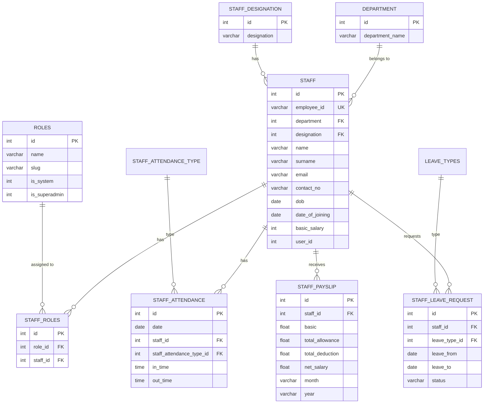
```mermaid
erDiagram
    STAFF ||--o{ STAFF_ROLES : "has"
    ROLES ||--o{ STAFF_ROLES : "assigned to"
    DEPARTMENT ||--o{ STAFF : "belongs to"
    STAFF_DESIGNATION ||--o{ STAFF : "has"
    
    STAFF {
        int id PK
        varchar employee_id UK
        int department FK
        int designation FK
        varchar name
        varchar surname
        varchar email
        varchar contact_no
        date dob
        date date_of_joining
        int basic_salary
        int user_id
    }
    
    ROLES {
        int id PK
        varchar name
        varchar slug
        int is_system
        int is_superadmin
    }
    
    STAFF_ROLES {
        int id PK
        int role_id FK
        int staff_id FK
    }
    
    DEPARTMENT {
        int id PK
        varchar department_name
    }
    
    STAFF_DESIGNATION {
        int id PK
        varchar designation
    }
    
    STAFF ||--o{ STAFF_ATTENDANCE : "has"
    STAFF_ATTENDANCE_TYPE ||--o{ STAFF_ATTENDANCE : "type"
    
    STAFF_ATTENDANCE {
        int id PK
        date date
        int staff_id FK
        int staff_attendance_type_id FK
        time in_time
        time out_time
    }
    
    STAFF ||--o{ STAFF_LEAVE_REQUEST : "requests"
    LEAVE_TYPES ||--o{ STAFF_LEAVE_REQUEST : "type"
    
    STAFF_LEAVE_REQUEST {
        int id PK
        int staff_id FK
        int leave_type_id FK
        date leave_from
        date leave_to
        varchar status
    }
    
    STAFF ||--o{ STAFF_PAYSLIP : "receives"
    
    STAFF_PAYSLIP {
        int id PK
        int staff_id FK
        float basic
        float total_allowance
        float total_deduction
        float net_salary
        varchar month
        varchar year
    }
```

### Fee Management Module

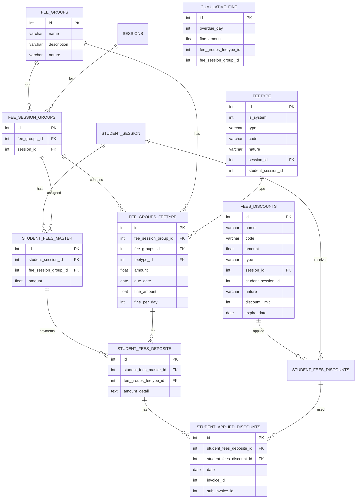
```mermaid
erDiagram
    FEE_GROUPS ||--o{ FEE_SESSION_GROUPS : "has"
    SESSIONS ||--o{ FEE_SESSION_GROUPS : "for"
    
    FEE_GROUPS {
        int id PK
        varchar name
        varchar description
        varchar nature
    }
    
    FEE_SESSION_GROUPS {
        int id PK
        int fee_groups_id FK
        int session_id FK
    }
    
    FEE_SESSION_GROUPS ||--o{ FEE_GROUPS_FEETYPE : "contains"
    FEE_GROUPS ||--o{ FEE_GROUPS_FEETYPE : "has"
    FEETYPE ||--o{ FEE_GROUPS_FEETYPE : "type"
    
    FEETYPE {
        int id PK
        int is_system
        varchar type
        varchar code
        varchar nature
        int session_id FK
        int student_session_id
    }
    
    FEE_GROUPS_FEETYPE {
        int id PK
        int fee_session_group_id FK
        int fee_groups_id FK
        int feetype_id FK
        float amount
        date due_date
        float fine_amount
        int fine_per_day
    }
    
    STUDENT_SESSION ||--o{ STUDENT_FEES_MASTER : "has"
    FEE_SESSION_GROUPS ||--o{ STUDENT_FEES_MASTER : "assigned"
    
    STUDENT_FEES_MASTER {
        int id PK
        int student_session_id FK
        int fee_session_group_id FK
        float amount
    }
    
    STUDENT_FEES_MASTER ||--o{ STUDENT_FEES_DEPOSITE : "payments"
    FEE_GROUPS_FEETYPE ||--o{ STUDENT_FEES_DEPOSITE : "for"
    
    STUDENT_FEES_DEPOSITE {
        int id PK
        int student_fees_master_id FK
        int fee_groups_feetype_id FK
        text amount_detail
    }
    
    FEES_DISCOUNTS ||--o{ STUDENT_FEES_DISCOUNTS : "applied"
    STUDENT_SESSION ||--o{ STUDENT_FEES_DISCOUNTS : "receives"
    
    FEES_DISCOUNTS {
        int id PK
        varchar name
        varchar code
        float amount
        varchar type
        int session_id FK
        int student_session_id
        varchar nature
        int discount_limit
        date expire_date
    }
    
    CUMULATIVE_FINE {
        int id PK
        int overdue_day
        float fine_amount
        int fee_groups_feetype_id
        int fee_session_group_id
    }

    STUDENT_APPLIED_DISCOUNTS {
        int id PK
        int student_fees_deposite_id FK
        int student_fees_discount_id FK
        date date
        int invoice_id
        int sub_invoice_id
    }

    STUDENT_FEES_DEPOSITE ||--o{ STUDENT_APPLIED_DISCOUNTS : "has"
    STUDENT_FEES_DISCOUNTS ||--o{ STUDENT_APPLIED_DISCOUNTS : "used"
```

### Examination Module

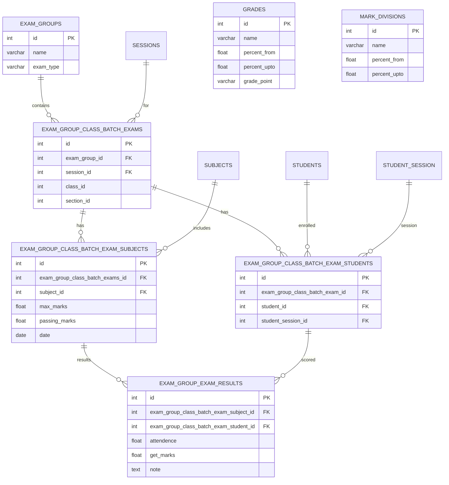
```mermaid
erDiagram
    EXAM_GROUPS ||--o{ EXAM_GROUP_CLASS_BATCH_EXAMS : "contains"
    SESSIONS ||--o{ EXAM_GROUP_CLASS_BATCH_EXAMS : "for"
    
    EXAM_GROUPS {
        int id PK
        varchar name
        varchar exam_type
    }
    
    EXAM_GROUP_CLASS_BATCH_EXAMS {
        int id PK
        int exam_group_id FK
        int session_id FK
        int class_id
        int section_id
    }
    
    EXAM_GROUP_CLASS_BATCH_EXAMS ||--o{ EXAM_GROUP_CLASS_BATCH_EXAM_SUBJECTS : "has"
    SUBJECTS ||--o{ EXAM_GROUP_CLASS_BATCH_EXAM_SUBJECTS : "includes"
    
    EXAM_GROUP_CLASS_BATCH_EXAM_SUBJECTS {
        int id PK
        int exam_group_class_batch_exams_id FK
        int subject_id FK
        float max_marks
        float passing_marks
        date date
    }
    
    EXAM_GROUP_CLASS_BATCH_EXAMS ||--o{ EXAM_GROUP_CLASS_BATCH_EXAM_STUDENTS : "has"
    STUDENTS ||--o{ EXAM_GROUP_CLASS_BATCH_EXAM_STUDENTS : "enrolled"
    STUDENT_SESSION ||--o{ EXAM_GROUP_CLASS_BATCH_EXAM_STUDENTS : "session"
    
    EXAM_GROUP_CLASS_BATCH_EXAM_STUDENTS {
        int id PK
        int exam_group_class_batch_exam_id FK
        int student_id FK
        int student_session_id FK
    }
    
    EXAM_GROUP_CLASS_BATCH_EXAM_SUBJECTS ||--o{ EXAM_GROUP_EXAM_RESULTS : "results"
    EXAM_GROUP_CLASS_BATCH_EXAM_STUDENTS ||--o{ EXAM_GROUP_EXAM_RESULTS : "scored"
    
    EXAM_GROUP_EXAM_RESULTS {
        int id PK
        int exam_group_class_batch_exam_subject_id FK
        int exam_group_class_batch_exam_student_id FK
        float attendence
        float get_marks
        text note
    }
    
    GRADES {
        int id PK
        varchar name
        float percent_from
        float percent_upto
        varchar grade_point
    }
    
    MARK_DIVISIONS {
        int id PK
        varchar name
        float percent_from
        float percent_upto
    }
```

### Online Examination Module

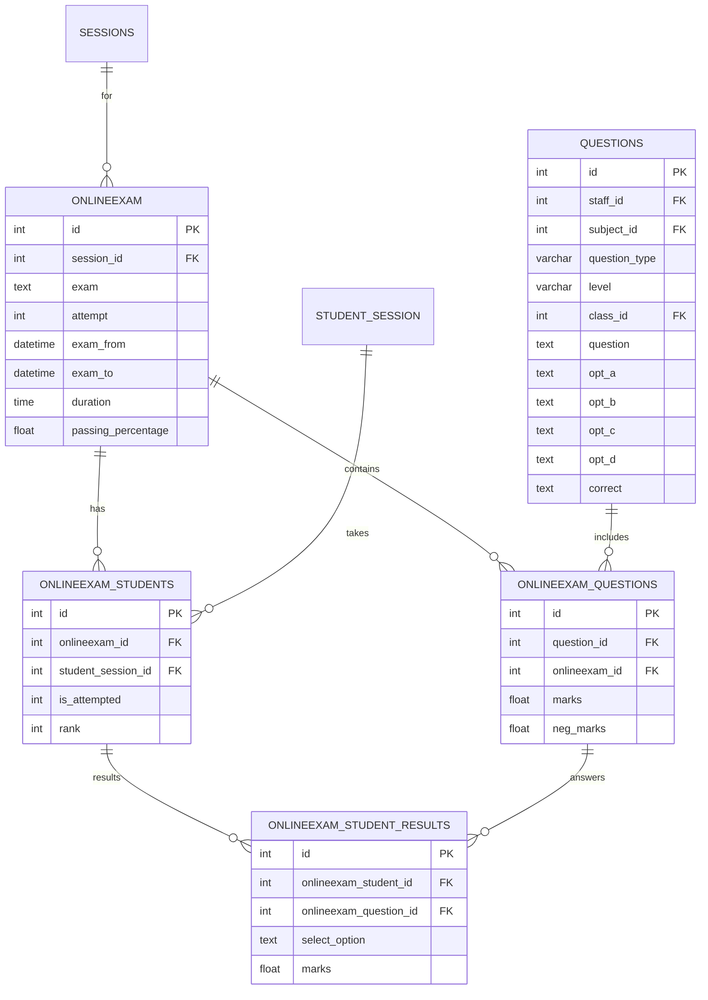
```mermaid
erDiagram
    ONLINEEXAM ||--o{ ONLINEEXAM_STUDENTS : "has"
    SESSIONS ||--o{ ONLINEEXAM : "for"
    STUDENT_SESSION ||--o{ ONLINEEXAM_STUDENTS : "takes"
    
    ONLINEEXAM {
        int id PK
        int session_id FK
        text exam
        int attempt
        datetime exam_from
        datetime exam_to
        time duration
        float passing_percentage
    }
    
    ONLINEEXAM_STUDENTS {
        int id PK
        int onlineexam_id FK
        int student_session_id FK
        int is_attempted
        int rank
    }
    
    ONLINEEXAM ||--o{ ONLINEEXAM_QUESTIONS : "contains"
    QUESTIONS ||--o{ ONLINEEXAM_QUESTIONS : "includes"
    
    QUESTIONS {
        int id PK
        int staff_id FK
        int subject_id FK
        varchar question_type
        varchar level
        int class_id FK
        text question
        text opt_a
        text opt_b
        text opt_c
        text opt_d
        text correct
    }
    
    ONLINEEXAM_QUESTIONS {
        int id PK
        int question_id FK
        int onlineexam_id FK
        float marks
        float neg_marks
    }
    
    ONLINEEXAM_STUDENTS ||--o{ ONLINEEXAM_STUDENT_RESULTS : "results"
    ONLINEEXAM_QUESTIONS ||--o{ ONLINEEXAM_STUDENT_RESULTS : "answers"
    
    ONLINEEXAM_STUDENT_RESULTS {
        int id PK
        int onlineexam_student_id FK
        int onlineexam_question_id FK
        text select_option
        float marks
    }
```

### Subject & Timetable Module

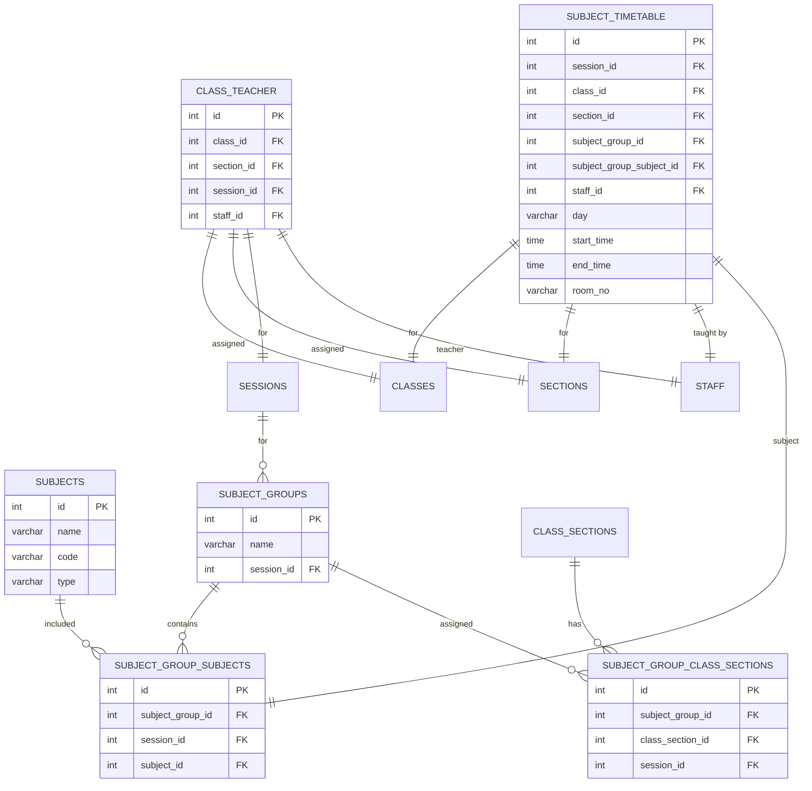
```mermaid
erDiagram
    SUBJECTS {
        int id PK
        varchar name
        varchar code
        varchar type
    }
    
    SUBJECT_GROUPS ||--o{ SUBJECT_GROUP_SUBJECTS : "contains"
    SUBJECTS ||--o{ SUBJECT_GROUP_SUBJECTS : "included"
    SESSIONS ||--o{ SUBJECT_GROUPS : "for"
    
    SUBJECT_GROUPS {
        int id PK
        varchar name
        int session_id FK
    }
    
    SUBJECT_GROUP_SUBJECTS {
        int id PK
        int subject_group_id FK
        int session_id FK
        int subject_id FK
    }
    
    SUBJECT_GROUPS ||--o{ SUBJECT_GROUP_CLASS_SECTIONS : "assigned"
    CLASS_SECTIONS ||--o{ SUBJECT_GROUP_CLASS_SECTIONS : "has"
    
    SUBJECT_GROUP_CLASS_SECTIONS {
        int id PK
        int subject_group_id FK
        int class_section_id FK
        int session_id FK
    }
    
    SUBJECT_TIMETABLE ||--|| CLASSES : "for"
    SUBJECT_TIMETABLE ||--|| SECTIONS : "for"
    SUBJECT_TIMETABLE ||--|| STAFF : "taught by"
    SUBJECT_TIMETABLE ||--|| SUBJECT_GROUP_SUBJECTS : "subject"
    
    SUBJECT_TIMETABLE {
        int id PK
        int session_id FK
        int class_id FK
        int section_id FK
        int subject_group_id FK
        int subject_group_subject_id FK
        int staff_id FK
        varchar day
        time start_time
        time end_time
        varchar room_no
    }
    
    CLASS_TEACHER ||--|| CLASSES : "assigned"
    CLASS_TEACHER ||--|| SECTIONS : "assigned"
    CLASS_TEACHER ||--|| SESSIONS : "for"
    CLASS_TEACHER ||--|| STAFF : "teacher"
    
    CLASS_TEACHER {
        int id PK
        int class_id FK
        int section_id FK
        int session_id FK
        int staff_id FK
    }
```

### Attendance Module

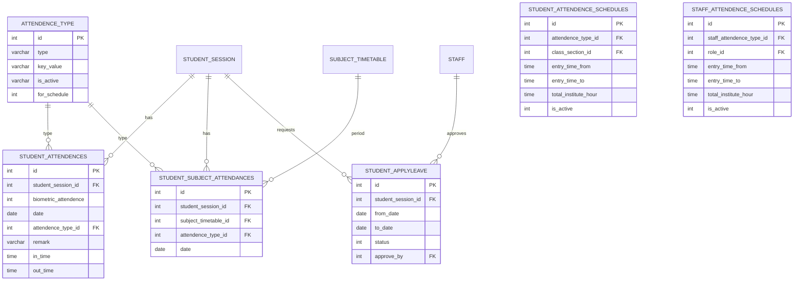
```mermaid
erDiagram
    ATTENDENCE_TYPE {
        int id PK
        varchar type
        varchar key_value
        varchar is_active
        int for_schedule
    }
    
    STUDENT_SESSION ||--o{ STUDENT_ATTENDENCES : "has"
    ATTENDENCE_TYPE ||--o{ STUDENT_ATTENDENCES : "type"
    
    STUDENT_ATTENDENCES {
        int id PK
        int student_session_id FK
        int biometric_attendence
        date date
        int attendence_type_id FK
        varchar remark
        time in_time
        time out_time
    }
    
    STUDENT_SESSION ||--o{ STUDENT_SUBJECT_ATTENDANCES : "has"
    ATTENDENCE_TYPE ||--o{ STUDENT_SUBJECT_ATTENDANCES : "type"
    SUBJECT_TIMETABLE ||--o{ STUDENT_SUBJECT_ATTENDANCES : "period"
    
    STUDENT_SUBJECT_ATTENDANCES {
        int id PK
        int student_session_id FK
        int subject_timetable_id FK
        int attendence_type_id FK
        date date
    }
    
    STUDENT_SESSION ||--o{ STUDENT_APPLYLEAVE : "requests"
    STAFF ||--o{ STUDENT_APPLYLEAVE : "approves"
    
    STUDENT_APPLYLEAVE {
        int id PK
        int student_session_id FK
        date from_date
        date to_date
        int status
        int approve_by FK
    }

    STUDENT_ATTENDENCE_SCHEDULES {
        int id PK
        int attendence_type_id FK
        int class_section_id FK
        time entry_time_from
        time entry_time_to
        time total_institute_hour
        int is_active
    }

    STAFF_ATTENDENCE_SCHEDULES {
        int id PK
        int staff_attendence_type_id FK
        int role_id FK
        time entry_time_from
        time entry_time_to
        time total_institute_hour
        int is_active
    }
```

### Homework & Lesson Plan Module

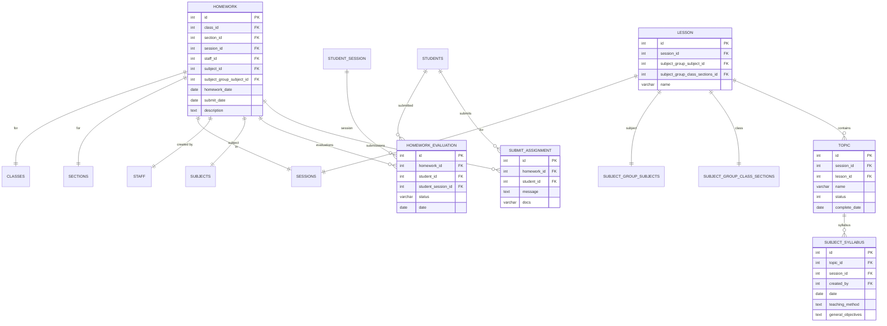
```mermaid
erDiagram
    HOMEWORK ||--|| CLASSES : "for"
    HOMEWORK ||--|| SECTIONS : "for"
    HOMEWORK ||--|| SESSIONS : "in"
    HOMEWORK ||--|| STAFF : "created by"
    HOMEWORK ||--|| SUBJECTS : "subject"
    
    HOMEWORK {
        int id PK
        int class_id FK
        int section_id FK
        int session_id FK
        int staff_id FK
        int subject_id FK
        int subject_group_subject_id FK
        date homework_date
        date submit_date
        text description
    }
    
    HOMEWORK ||--o{ HOMEWORK_EVALUATION : "evaluations"
    STUDENTS ||--o{ HOMEWORK_EVALUATION : "submitted"
    STUDENT_SESSION ||--o{ HOMEWORK_EVALUATION : "session"
    
    HOMEWORK_EVALUATION {
        int id PK
        int homework_id FK
        int student_id FK
        int student_session_id FK
        varchar status
        date date
    }
    
    HOMEWORK ||--o{ SUBMIT_ASSIGNMENT : "submissions"
    STUDENTS ||--o{ SUBMIT_ASSIGNMENT : "submits"
    
    SUBMIT_ASSIGNMENT {
        int id PK
        int homework_id FK
        int student_id FK
        text message
        varchar docs
    }
    
    LESSON ||--|| SESSIONS : "for"
    LESSON ||--|| SUBJECT_GROUP_SUBJECTS : "subject"
    LESSON ||--|| SUBJECT_GROUP_CLASS_SECTIONS : "class"
    
    LESSON {
        int id PK
        int session_id FK
        int subject_group_subject_id FK
        int subject_group_class_sections_id FK
        varchar name
    }
    
    LESSON ||--o{ TOPIC : "contains"
    
    TOPIC {
        int id PK
        int session_id FK
        int lesson_id FK
        varchar name
        int status
        date complete_date
    }
    
    TOPIC ||--o{ SUBJECT_SYLLABUS : "syllabus"
    
    SUBJECT_SYLLABUS {
        int id PK
        int topic_id FK
        int session_id FK
        int created_by FK
        date date
        text teaching_method
        text general_objectives
    }
```

### Library Module

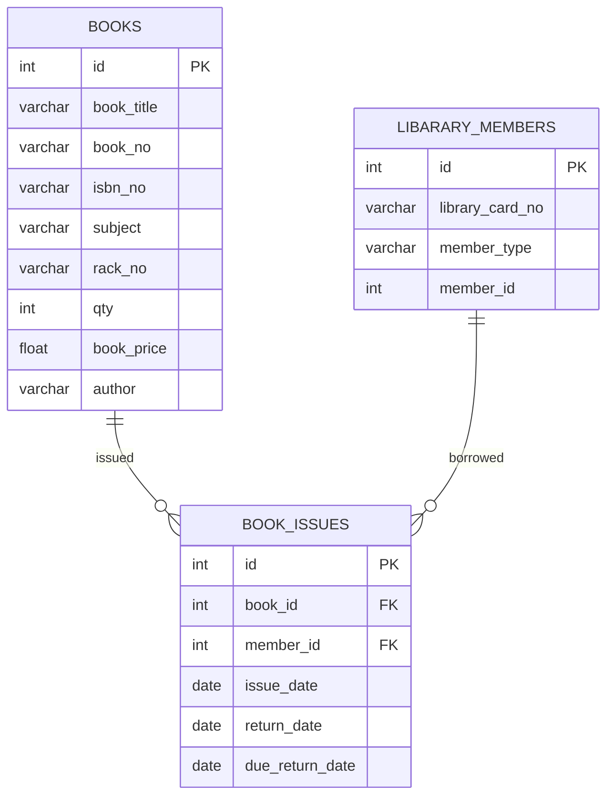
```mermaid
erDiagram
    BOOKS {
        int id PK
        varchar book_title
        varchar book_no
        varchar isbn_no
        varchar subject
        varchar rack_no
        int qty
        float book_price
        varchar author
    }
    
    LIBARARY_MEMBERS {
        int id PK
        varchar library_card_no
        varchar member_type
        int member_id
    }
    
    BOOKS ||--o{ BOOK_ISSUES : "issued"
    LIBARARY_MEMBERS ||--o{ BOOK_ISSUES : "borrowed"
    
    BOOK_ISSUES {
        int id PK
        int book_id FK
        int member_id FK
        date issue_date
        date return_date
        date due_return_date
    }
```

### Transport Module

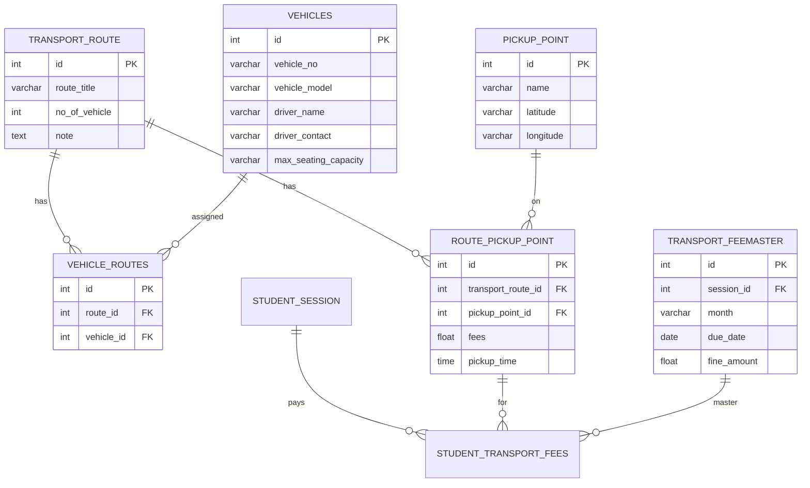
```mermaid
erDiagram
    TRANSPORT_ROUTE {
        int id PK
        varchar route_title
        int no_of_vehicle
        text note
    }
    
    VEHICLES {
        int id PK
        varchar vehicle_no
        varchar vehicle_model
        varchar driver_name
        varchar driver_contact
        varchar max_seating_capacity
    }
    
    TRANSPORT_ROUTE ||--o{ VEHICLE_ROUTES : "has"
    VEHICLES ||--o{ VEHICLE_ROUTES : "assigned"
    
    VEHICLE_ROUTES {
        int id PK
        int route_id FK
        int vehicle_id FK
    }
    
    PICKUP_POINT {
        int id PK
        varchar name
        varchar latitude
        varchar longitude
    }
    
    TRANSPORT_ROUTE ||--o{ ROUTE_PICKUP_POINT : "has"
    PICKUP_POINT ||--o{ ROUTE_PICKUP_POINT : "on"
    
    ROUTE_PICKUP_POINT {
        int id PK
        int transport_route_id FK
        int pickup_point_id FK
        float fees
        time pickup_time
    }
    
    STUDENT_SESSION ||--o{ STUDENT_TRANSPORT_FEES : "pays"
    ROUTE_PICKUP_POINT ||--o{ STUDENT_TRANSPORT_FEES : "for"
    TRANSPORT_FEEMASTER ||--o{ STUDENT_TRANSPORT_FEES : "master"
    
    TRANSPORT_FEEMASTER {
        int id PK
        int session_id FK
        varchar month
        date due_date
        float fine_amount
    }
```

### Hostel Module

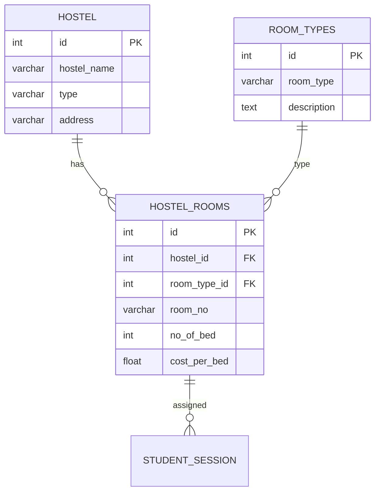
```mermaid
erDiagram
    HOSTEL {
        int id PK
        varchar hostel_name
        varchar type
        varchar address
    }
    
    ROOM_TYPES {
        int id PK
        varchar room_type
        text description
    }
    
    HOSTEL ||--o{ HOSTEL_ROOMS : "has"
    ROOM_TYPES ||--o{ HOSTEL_ROOMS : "type"
    
    HOSTEL_ROOMS {
        int id PK
        int hostel_id FK
        int room_type_id FK
        varchar room_no
        int no_of_bed
        float cost_per_bed
    }
    
    HOSTEL_ROOMS ||--o{ STUDENT_SESSION : "assigned"
```

### Inventory Module

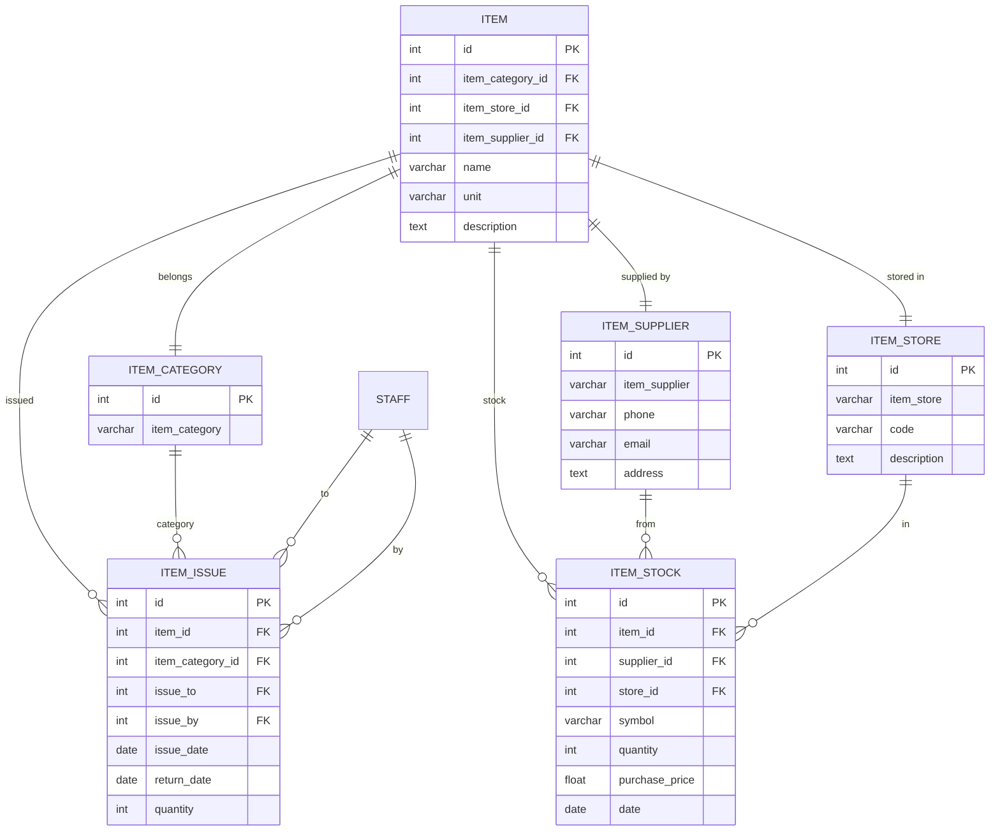
```mermaid
erDiagram
    ITEM_CATEGORY {
        int id PK
        varchar item_category
    }
    
    ITEM_STORE {
        int id PK
        varchar item_store
        varchar code
        text description
    }
    
    ITEM_SUPPLIER {
        int id PK
        varchar item_supplier
        varchar phone
        varchar email
        text address
    }
    
    ITEM ||--|| ITEM_CATEGORY : "belongs"
    ITEM ||--|| ITEM_STORE : "stored in"
    ITEM ||--|| ITEM_SUPPLIER : "supplied by"
    
    ITEM {
        int id PK
        int item_category_id FK
        int item_store_id FK
        int item_supplier_id FK
        varchar name
        varchar unit
        text description
    }
    
    ITEM ||--o{ ITEM_STOCK : "stock"
    ITEM_SUPPLIER ||--o{ ITEM_STOCK : "from"
    ITEM_STORE ||--o{ ITEM_STOCK : "in"
    
    ITEM_STOCK {
        int id PK
        int item_id FK
        int supplier_id FK
        int store_id FK
        varchar symbol
        int quantity
        float purchase_price
        date date
    }
    
    ITEM ||--o{ ITEM_ISSUE : "issued"
    ITEM_CATEGORY ||--o{ ITEM_ISSUE : "category"
    STAFF ||--o{ ITEM_ISSUE : "to"
    STAFF ||--o{ ITEM_ISSUE : "by"
    
    ITEM_ISSUE {
        int id PK
        int item_id FK
        int item_category_id FK
        int issue_to FK
        int issue_by FK
        date issue_date
        date return_date
        int quantity
    }
```

### Front Office Module

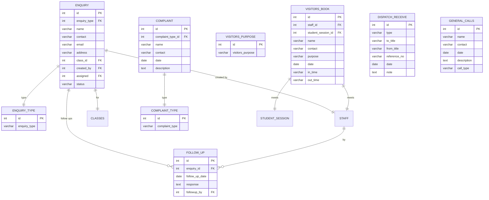
```mermaid
erDiagram
    ENQUIRY_TYPE {
        int id PK
        varchar enquiry_type
    }
    
    ENQUIRY ||--|| ENQUIRY_TYPE : "type"
    ENQUIRY ||--|| STAFF : "created by"
    ENQUIRY ||--|| CLASSES : "for"
    
    ENQUIRY {
        int id PK
        int enquiry_type FK
        varchar name
        varchar contact
        varchar email
        varchar address
        int class_id FK
        int created_by FK
        int assigned FK
        varchar status
    }
    
    ENQUIRY ||--o{ FOLLOW_UP : "follow ups"
    STAFF ||--o{ FOLLOW_UP : "by"
    
    FOLLOW_UP {
        int id PK
        int enquiry_id FK
        date follow_up_date
        text response
        int followup_by FK
    }
    
    COMPLAINT_TYPE {
        int id PK
        varchar complaint_type
    }
    
    COMPLAINT ||--|| COMPLAINT_TYPE : "type"
    
    COMPLAINT {
        int id PK
        int complaint_type_id FK
        varchar name
        varchar contact
        date date
        text description
    }
    
    VISITORS_PURPOSE {
        int id PK
        varchar visitors_purpose
    }
    
    VISITORS_BOOK ||--|| STAFF : "meets"
    VISITORS_BOOK ||--|| STUDENT_SESSION : "meets"
    
    VISITORS_BOOK {
        int id PK
        int staff_id FK
        int student_session_id FK
        varchar name
        varchar contact
        varchar purpose
        date date
        varchar in_time
        varchar out_time
    }
    
    DISPATCH_RECEIVE {
        int id PK
        varchar type
        varchar to_title
        varchar from_title
        varchar reference_no
        date date
        text note
    }
    
    GENERAL_CALLS {
        int id PK
        varchar name
        varchar contact
        date date
        text description
        varchar call_type
    }
```

### Communication Module

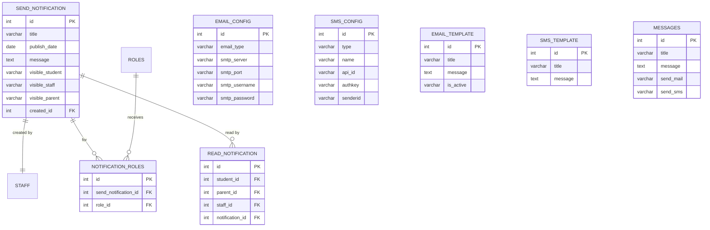
```mermaid
erDiagram
    SEND_NOTIFICATION ||--|| STAFF : "created by"
    
    SEND_NOTIFICATION {
        int id PK
        varchar title
        date publish_date
        text message
        varchar visible_student
        varchar visible_staff
        varchar visible_parent
        int created_id FK
    }
    
    SEND_NOTIFICATION ||--o{ NOTIFICATION_ROLES : "for"
    ROLES ||--o{ NOTIFICATION_ROLES : "receives"
    
    NOTIFICATION_ROLES {
        int id PK
        int send_notification_id FK
        int role_id FK
    }
    
    SEND_NOTIFICATION ||--o{ READ_NOTIFICATION : "read by"
    
    READ_NOTIFICATION {
        int id PK
        int student_id FK
        int parent_id FK
        int staff_id FK
        int notification_id FK
    }
    
    EMAIL_CONFIG {
        int id PK
        varchar email_type
        varchar smtp_server
        varchar smtp_port
        varchar smtp_username
        varchar smtp_password
    }
    
    SMS_CONFIG {
        int id PK
        varchar type
        varchar name
        varchar api_id
        varchar authkey
        varchar senderid
    }
    
    EMAIL_TEMPLATE {
        int id PK
        varchar title
        text message
        varchar is_active
    }
    
    SMS_TEMPLATE {
        int id PK
        varchar title
        text message
    }
    
    MESSAGES {
        int id PK
        varchar title
        text message
        varchar send_mail
        varchar send_sms
    }
```

### Chat Module

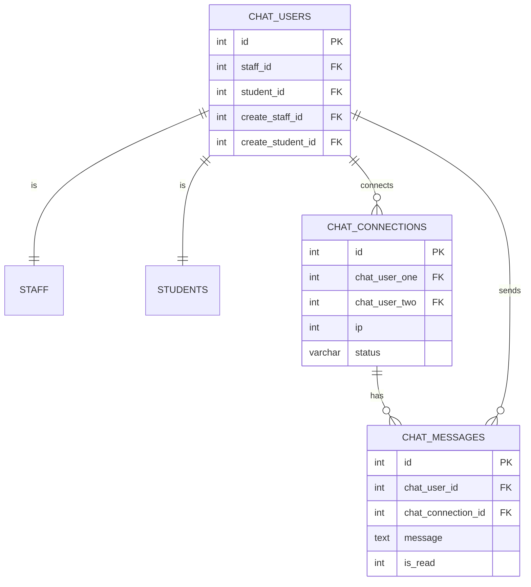
```mermaid
erDiagram
    CHAT_USERS ||--|| STAFF : "is"
    CHAT_USERS ||--|| STUDENTS : "is"
    
    CHAT_USERS {
        int id PK
        int staff_id FK
        int student_id FK
        int create_staff_id FK
        int create_student_id FK
    }
    
    CHAT_USERS ||--o{ CHAT_CONNECTIONS : "connects"
    
    CHAT_CONNECTIONS {
        int id PK
        int chat_user_one FK
        int chat_user_two FK
        int ip
        varchar status
    }
    
    CHAT_CONNECTIONS ||--o{ CHAT_MESSAGES : "has"
    CHAT_USERS ||--o{ CHAT_MESSAGES : "sends"
    
    CHAT_MESSAGES {
        int id PK
        int chat_user_id FK
        int chat_connection_id FK
        text message
        int is_read
    }
```

### Download Center & Content Module

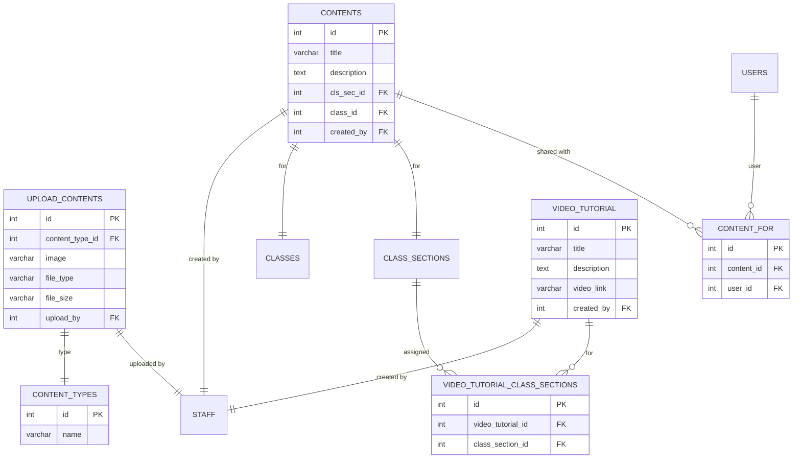
```mermaid
erDiagram
    CONTENT_TYPES {
        int id PK
        varchar name
    }
    
    UPLOAD_CONTENTS ||--|| CONTENT_TYPES : "type"
    UPLOAD_CONTENTS ||--|| STAFF : "uploaded by"
    
    UPLOAD_CONTENTS {
        int id PK
        int content_type_id FK
        varchar image
        varchar file_type
        varchar file_size
        int upload_by FK
    }
    
    CONTENTS ||--|| STAFF : "created by"
    CONTENTS ||--|| CLASSES : "for"
    CONTENTS ||--|| CLASS_SECTIONS : "for"
    
    CONTENTS {
        int id PK
        varchar title
        text description
        int cls_sec_id FK
        int class_id FK
        int created_by FK
    }
    
    CONTENTS ||--o{ CONTENT_FOR : "shared with"
    USERS ||--o{ CONTENT_FOR : "user"
    
    CONTENT_FOR {
        int id PK
        int content_id FK
        int user_id FK
    }
    
    VIDEO_TUTORIAL ||--|| STAFF : "created by"
    
    VIDEO_TUTORIAL {
        int id PK
        varchar title
        text description
        varchar video_link
        int created_by FK
    }
    
    VIDEO_TUTORIAL ||--o{ VIDEO_TUTORIAL_CLASS_SECTIONS : "for"
    CLASS_SECTIONS ||--o{ VIDEO_TUTORIAL_CLASS_SECTIONS : "assigned"
    
    VIDEO_TUTORIAL_CLASS_SECTIONS {
        int id PK
        int video_tutorial_id FK
        int class_section_id FK
    }
```

### Permission & Roles Module

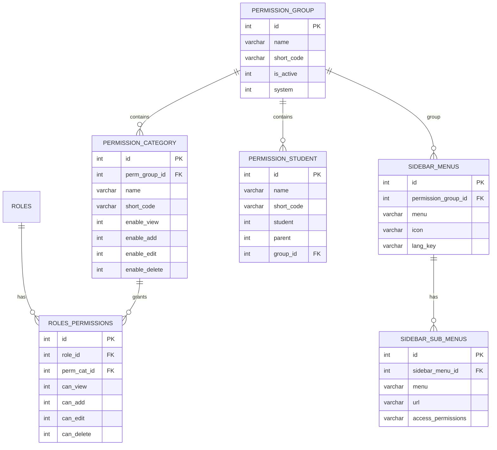
```mermaid
erDiagram
    PERMISSION_GROUP {
        int id PK
        varchar name
        varchar short_code
        int is_active
        int system
    }
    
    PERMISSION_GROUP ||--o{ PERMISSION_CATEGORY : "contains"
    
    PERMISSION_CATEGORY {
        int id PK
        int perm_group_id FK
        varchar name
        varchar short_code
        int enable_view
        int enable_add
        int enable_edit
        int enable_delete
    }
    
    ROLES ||--o{ ROLES_PERMISSIONS : "has"
    PERMISSION_CATEGORY ||--o{ ROLES_PERMISSIONS : "grants"
    
    ROLES_PERMISSIONS {
        int id PK
        int role_id FK
        int perm_cat_id FK
        int can_view
        int can_add
        int can_edit
        int can_delete
    }
    
    PERMISSION_GROUP ||--o{ PERMISSION_STUDENT : "contains"
    
    PERMISSION_STUDENT {
        int id PK
        varchar name
        varchar short_code
        int student
        int parent
        int group_id FK
    }
    
    PERMISSION_GROUP ||--o{ SIDEBAR_MENUS : "group"
    
    SIDEBAR_MENUS {
        int id PK
        int permission_group_id FK
        varchar menu
        varchar icon
        varchar lang_key
    }
    
    SIDEBAR_MENUS ||--o{ SIDEBAR_SUB_MENUS : "has"
    
    SIDEBAR_SUB_MENUS {
        int id PK
        int sidebar_menu_id FK
        varchar menu
        varchar url
        varchar access_permissions
    }
```

### Online Admission Module

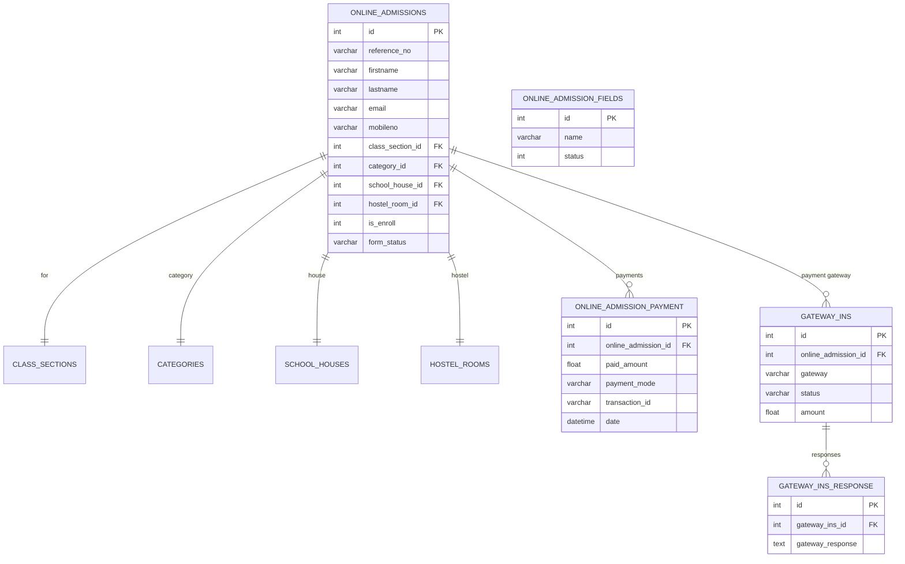
```mermaid
erDiagram
    ONLINE_ADMISSIONS ||--|| CLASS_SECTIONS : "for"
    ONLINE_ADMISSIONS ||--|| CATEGORIES : "category"
    ONLINE_ADMISSIONS ||--|| SCHOOL_HOUSES : "house"
    ONLINE_ADMISSIONS ||--|| HOSTEL_ROOMS : "hostel"
    
    ONLINE_ADMISSIONS {
        int id PK
        varchar reference_no
        varchar firstname
        varchar lastname
        varchar email
        varchar mobileno
        int class_section_id FK
        int category_id FK
        int school_house_id FK
        int hostel_room_id FK
        int is_enroll
        varchar form_status
    }
    
    ONLINE_ADMISSIONS ||--o{ ONLINE_ADMISSION_PAYMENT : "payments"
    
    ONLINE_ADMISSION_PAYMENT {
        int id PK
        int online_admission_id FK
        float paid_amount
        varchar payment_mode
        varchar transaction_id
        datetime date
    }
    
    ONLINE_ADMISSIONS ||--o{ GATEWAY_INS : "payment gateway"
    
    GATEWAY_INS {
        int id PK
        int online_admission_id FK
        varchar gateway
        varchar status
        float amount
    }
    
    GATEWAY_INS ||--o{ GATEWAY_INS_RESPONSE : "responses"
    
    GATEWAY_INS_RESPONSE {
        int id PK
        int gateway_ins_id FK
        text gateway_response
    }
    
    ONLINE_ADMISSION_FIELDS {
        int id PK
        varchar name
        int status
    }
```

### Alumni Module

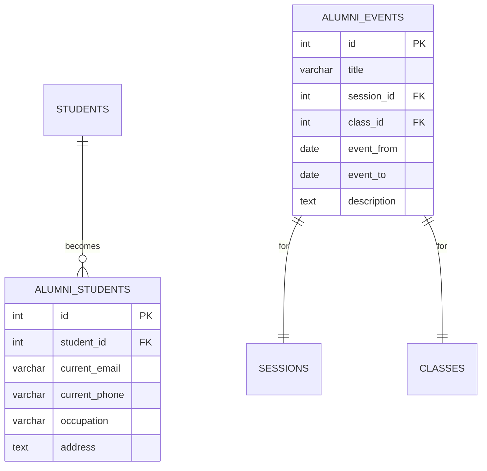
```mermaid
erDiagram
    STUDENTS ||--o{ ALUMNI_STUDENTS : "becomes"
    
    ALUMNI_STUDENTS {
        int id PK
        int student_id FK
        varchar current_email
        varchar current_phone
        varchar occupation
        text address
    }
    
    ALUMNI_EVENTS ||--|| SESSIONS : "for"
    ALUMNI_EVENTS ||--|| CLASSES : "for"
    
    ALUMNI_EVENTS {
        int id PK
        varchar title
        int session_id FK
        int class_id FK
        date event_from
        date event_to
        text description
    }
```

### Certificate Module

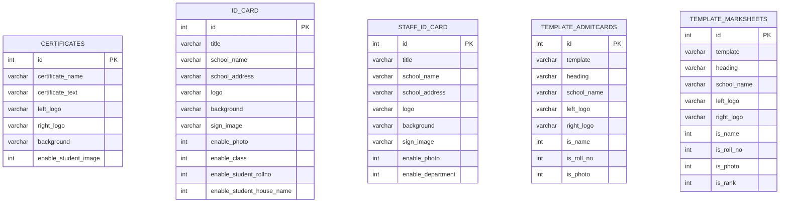
```mermaid
erDiagram
    CERTIFICATES {
        int id PK
        varchar certificate_name
        varchar certificate_text
        varchar left_logo
        varchar right_logo
        varchar background
        int enable_student_image
    }
    
    ID_CARD {
        int id PK
        varchar title
        varchar school_name
        varchar school_address
        varchar logo
        varchar background
        varchar sign_image
        int enable_photo
        int enable_class
        int enable_student_rollno
        int enable_student_house_name
    }
    
    STAFF_ID_CARD {
        int id PK
        varchar title
        varchar school_name
        varchar school_address
        varchar logo
        varchar background
        varchar sign_image
        int enable_photo
        int enable_department
    }
    
    TEMPLATE_ADMITCARDS {
        int id PK
        varchar template
        varchar heading
        varchar school_name
        varchar left_logo
        varchar right_logo
        int is_name
        int is_roll_no
        int is_photo
    }
    
    TEMPLATE_MARKSHEETS {
        int id PK
        varchar template
        varchar heading
        varchar school_name
        varchar left_logo
        varchar right_logo
        int is_name
        int is_roll_no
        int is_photo
        int is_rank
    }
```

### Settings & Configuration Module

```mermaid
erDiagram
    SCH_SETTINGS {
        int id PK
        varchar name
        varchar email
        varchar phone
        text address
        int lang_id FK
        int session_id FK
        varchar timezone
        varchar currency
        varchar currency_symbol
        varchar date_format
        varchar theme
    }
    
    LANGUAGES {
        int id PK
        varchar language
        varchar short_code
    }
    
    CURRENCIES {
        int id PK
        varchar name
        varchar short_name
        varchar symbol
    }
    
    PAYMENT_SETTINGS {
        int id PK
        varchar payment_type
        varchar api_secret_key
        varchar api_publishable_key
        varchar is_active
    }
    
    NOTIFICATION_SETTING {
        int id PK
        varchar type
        int is_mail
        int is_sms
    }
    
    CUSTOM_FIELDS {
        int id PK
        varchar name
        varchar belong_to
        varchar type
        text field_values
        int weight
    }
    
    CUSTOM_FIELDS ||--o{ CUSTOM_FIELD_VALUES : "values"
    
    CUSTOM_FIELD_VALUES {
        int id PK
        int belong_table_id
        int custom_field_id FK
        text field_value
    }
    
    FILETYPES {
        int id PK
        varchar file_extension
        varchar file_mime
    }

    STUDENT_DASHBOARD_SETTINGS {
        int id PK
        varchar name
        varchar short_code
        int is_student
        int is_parent
    }
```

### Income & Expense Module

```mermaid
erDiagram
    INCOME_HEAD {
        int id PK
        varchar income_head
        text description
    }
    
    INCOME_HEAD ||--o{ INCOME : "category"
    
    INCOME {
        int id PK
        int income_head_id FK
        varchar name
        varchar invoice_no
        date date
        float amount
        text description
    }
    
    EXPENSE_HEAD {
        int id PK
        varchar expense_head
        text description
    }
    
    EXPENSE_HEAD ||--o{ EXPENSES : "category"
    
    EXPENSES {
        int id PK
        int exp_head_id FK
        varchar name
        varchar invoice_no
        date date
        float amount
        text description
    }
```

### Front CMS Module

```mermaid
erDiagram
    FRONT_CMS_SETTINGS {
        int id PK
        varchar theme
        varchar is_active_front_cms
        varchar is_active_rtl
    }
    
    FRONT_CMS_MENUS {
        int id PK
        varchar menu
        varchar slug
        varchar description
    }
    
    FRONT_CMS_MENUS ||--o{ FRONT_CMS_MENU_ITEMS : "has"
    
    FRONT_CMS_MENU_ITEMS {
        int id PK
        int menu_id FK
        varchar menu_title
        varchar page_slug
        varchar url
        int open_new_tab
    }
    
    FRONT_CMS_PAGES {
        int id PK
        varchar page_type
        varchar slug
        varchar title
        varchar meta_title
        text meta_description
    }
    
    FRONT_CMS_PAGES ||--o{ FRONT_CMS_PAGE_CONTENTS : "has"
    
    FRONT_CMS_PAGE_CONTENTS {
        int id PK
        int page_id FK
        text content
    }
    
    FRONT_CMS_PROGRAMS {
        int id PK
        varchar title
        text description
    }
    
    FRONT_CMS_PROGRAMS ||--o{ FRONT_CMS_PROGRAM_PHOTOS : "has"
    
    FRONT_CMS_PROGRAM_PHOTOS {
        int id PK
        int program_id FK
        varchar photo
    }
    
    FRONT_CMS_MEDIA_GALLERY {
        int id PK
        varchar image
        varchar thumb_path
        varchar file_type
    }
    
    EVENTS ||--|| ROLES : "visible to"
    
    EVENTS {
        int id PK
        varchar event_title
        date event_start
        date event_end
        text event_description
        int role_id FK
        varchar is_active
    }
```

### Resume & Student Profile Module

```mermaid
erDiagram
    STUDENT_WORK_EXPERIENCE {
        int id PK
        text institute
        text designation
        varchar year
        text location
        text detail
        varchar student_id
    }

    STUDENT_EDUCATIONAL_DETAILS {
        int id PK
        varchar course
        varchar university
        varchar education_year
        varchar education_detail
        varchar student_id
    }

    STUDENT_SKILLS_DETAIL {
        int id PK
        varchar skill_category
        varchar skill_detail
        varchar student_id
    }

    STUDENT_REFRENCE {
        int id PK
        varchar name
        varchar relation
        varchar age
        varchar profession
        varchar contact
        int student_id
    }

    RESUME_SETTINGS_FIELDS {
        int id PK
        varchar name
        int status
    }

    RESUME_ADDITIONAL_FIELDS_SETTINGS {
        int id PK
        varchar name
        int status
    }

    STUDENT_WORK_EXPERIENCE }|..|| STUDENTS : "belongs to"
    STUDENT_EDUCATIONAL_DETAILS }|..|| STUDENTS : "belongs to"
    STUDENT_SKILLS_DETAIL }|..|| STUDENTS : "belongs to"
    STUDENT_REFRENCE }|..|| STUDENTS : "belongs to"
```

### Calendar Module

```mermaid
erDiagram
    ANNUAL_CALENDAR {
        int id PK
        int session_id FK
        int holiday_type
        datetime from_date
        datetime to_date
        text description
        varchar holiday_color
    }

    HOLIDAY_TYPE {
        int id PK
        varchar type
        int is_default
    }

    ANNUAL_CALENDAR }o..|| SESSIONS : "belongs to"
    ANNUAL_CALENDAR }o..|| HOLIDAY_TYPE : "type"
```

### Addons Module

```mermaid
erDiagram
    ADDONS {
        int id PK
        int product_id
        varchar name
        varchar short_name
        float price
        varchar current_version
    }

    ADDON_VERSIONS {
        int id PK
        int addon_id FK
        varchar version
        text folder_path
    }

    ADDONS ||--o{ ADDON_VERSIONS : "has"
```

---

## 📋 Complete Table List (135+ Tables)

### Core Tables
| # | Table Name | Purpose |
|---|-----------|---------|
| 1 | `students` | Student master data |
| 2 | `student_session` | Student enrollment per session |
| 3 | `staff` | Staff/employee master data |
| 4 | `users` | System users (students, parents, staff) |
| 5 | `sessions` | Academic sessions/years |
| 6 | `classes` | Class definitions |
| 7 | `sections` | Section definitions |
| 8 | `class_sections` | Class-section mapping |
| 9 | `subjects` | Subject master |
| 10 | `categories` | Student categories |

### Fee Management Tables
| # | Table Name | Purpose |
|---|-----------|---------|
| 11 | `fee_groups` | Fee group definitions |
| 12 | `feetype` | Fee type definitions |
| 13 | `fee_session_groups` | Fee groups per session |
| 14 | `fee_groups_feetype` | Fee types in groups |
| 15 | `feemasters` | Fee master configuration |
| 16 | `student_fees_master` | Student fee assignments |
| 17 | `student_fees_deposite` | Fee payment records |
| 18 | `student_fees` | Student fee payments |
| 19 | `fees_discounts` | Discount definitions |
| 20 | `student_fees_discounts` | Student discount assignments |
| 21 | `student_applied_discounts` | Applied discount records |
| 22 | `fees_reminder` | Fee reminder settings |
| 23 | `fee_receipt_no` | Receipt number tracking |
| 24 | `offline_fees_payments` | Offline payment records |
| 25 | `cumulative_fine` | Fine configuration |

### Examination Tables
| # | Table Name | Purpose |
|---|-----------|---------|
| 26 | `exam_groups` | Exam group definitions |
| 27 | `exams` | Exam definitions |
| 28 | `exam_schedules` | Exam schedules |
| 29 | `exam_group_class_batch_exams` | Exam-class mapping |
| 30 | `exam_group_class_batch_exam_subjects` | Exam subjects |
| 31 | `exam_group_class_batch_exam_students` | Exam student enrollment |
| 32 | `exam_group_students` | Student exam groups |
| 33 | `exam_group_exam_results` | Exam results |
| 34 | `exam_group_exam_connections` | Exam connections |
| 35 | `grades` | Grading system |
| 36 | `mark_divisions` | Mark divisions |
| 37 | `template_admitcards` | Admit card templates |
| 38 | `template_marksheets` | Marksheet templates |

### Online Examination Tables
| # | Table Name | Purpose |
|---|-----------|---------|
| 39 | `onlineexam` | Online exam definitions |
| 40 | `onlineexam_students` | Online exam students |
| 41 | `onlineexam_questions` | Online exam questions |
| 42 | `onlineexam_attempts` | Exam attempts |
| 43 | `onlineexam_student_results` | Online exam results |
| 44 | `questions` | Question bank |

### Attendance Tables
| # | Table Name | Purpose |
|---|-----------|---------|
| 45 | `attendence_type` | Attendance type definitions |
| 46 | `student_attendences` | Student attendance records |
| 47 | `student_subject_attendances` | Period-wise attendance |
| 48 | `student_attendence_schedules` | Attendance schedule |
| 49 | `student_applyleave` | Student leave applications |
| 50 | `staff_attendance` | Staff attendance |
| 51 | `staff_attendance_type` | Staff attendance types |
| 52 | `staff_attendence_schedules` | Staff attendance schedules |
| 53 | `staff_leave_request` | Staff leave requests |
| 54 | `staff_leave_details` | Staff leave details |
| 55 | `leave_types` | Leave type definitions |

### Human Resource Tables
| # | Table Name | Purpose |
|---|-----------|---------|
| 56 | `department` | Department definitions |
| 57 | `staff_designation` | Designation definitions |
| 58 | `staff_roles` | Staff role assignments |
| 59 | `staff_timeline` | Staff timeline events |
| 60 | `staff_payroll` | Payroll configuration |
| 61 | `staff_payslip` | Staff payslips |
| 62 | `payslip_allowance` | Payslip allowances |
| 63 | `staff_rating` | Staff ratings |

### Academic Tables
| # | Table Name | Purpose |
|---|-----------|---------|
| 64 | `subject_groups` | Subject group definitions |
| 65 | `subject_group_subjects` | Subjects in groups |
| 66 | `subject_group_class_sections` | Subject groups per class |
| 67 | `subject_timetable` | Class timetable |
| 68 | `class_teacher` | Class teacher assignments |
| 69 | `class_section_times` | Class timings |

### Homework & Lesson Plan Tables
| # | Table Name | Purpose |
|---|-----------|---------|
| 70 | `homework` | Homework assignments |
| 71 | `homework_evaluation` | Homework evaluations |
| 72 | `submit_assignment` | Assignment submissions |
| 73 | `daily_assignment` | Daily assignments |
| 74 | `lesson` | Lesson definitions |
| 75 | `topic` | Topic definitions |
| 76 | `subject_syllabus` | Syllabus details |
| 77 | `lesson_plan_forum` | Lesson plan discussions |

### Library Tables
| # | Table Name | Purpose |
|---|-----------|---------|
| 78 | `books` | Book inventory |
| 79 | `book_issues` | Book issue records |
| 80 | `libarary_members` | Library members |

### Transport Tables
| # | Table Name | Purpose |
|---|-----------|---------|
| 81 | `transport_route` | Route definitions |
| 82 | `vehicles` | Vehicle inventory |
| 83 | `vehicle_routes` | Vehicle-route mapping |
| 84 | `pickup_point` | Pickup point definitions |
| 85 | `route_pickup_point` | Route pickup points |
| 86 | `transport_feemaster` | Transport fee master |
| 87 | `student_transport_fees` | Student transport fees |

### Hostel Tables
| # | Table Name | Purpose |
|---|-----------|---------|
| 88 | `hostel` | Hostel definitions |
| 89 | `room_types` | Room type definitions |
| 90 | `hostel_rooms` | Hostel room inventory |

### Inventory Tables
| # | Table Name | Purpose |
|---|-----------|---------|
| 91 | `item_category` | Item categories |
| 92 | `item_store` | Item stores |
| 93 | `item_supplier` | Item suppliers |
| 94 | `item` | Item inventory |
| 95 | `item_stock` | Item stock records |
| 96 | `item_issue` | Item issue records |

### Front Office Tables
| # | Table Name | Purpose |
|---|-----------|---------|
| 97 | `enquiry` | Admission enquiries |
| 98 | `enquiry_type` | Enquiry types |
| 99 | `follow_up` | Enquiry follow-ups |
| 100 | `complaint` | Complaints |
| 101 | `complaint_type` | Complaint types |
| 102 | `visitors_book` | Visitor records |
| 103 | `visitors_purpose` | Visitor purposes |
| 104 | `dispatch_receive` | Postal records |
| 105 | `general_calls` | Phone call logs |

### Communication Tables
| # | Table Name | Purpose |
|---|-----------|---------|
| 106 | `send_notification` | Notifications |
| 107 | `notification_roles` | Notification recipients |
| 108 | `read_notification` | Read status |
| 109 | `notification_setting` | Notification settings |
| 110 | `messages` | Email/SMS messages |
| 111 | `email_config` | Email configuration |
| 112 | `email_template` | Email templates |
| 113 | `email_attachments` | Email attachments |
| 114 | `sms_config` | SMS configuration |
| 115 | `sms_template` | SMS templates |

### Chat Tables
| # | Table Name | Purpose |
|---|-----------|---------|
| 116 | `chat_users` | Chat users |
| 117 | `chat_connections` | Chat connections |
| 118 | `chat_messages` | Chat messages |

### Content Management Tables
| # | Table Name | Purpose |
|---|-----------|---------|
| 119 | `content_types` | Content types |
| 120 | `contents` | Content records |
| 121 | `content_for` | Content sharing |
| 122 | `upload_contents` | Uploaded content |
| 123 | `share_contents` | Shared content |
| 124 | `share_content_for` | Share recipients |
| 125 | `share_upload_contents` | Shared uploads |
| 126 | `video_tutorial` | Video tutorials |
| 127 | `video_tutorial_class_sections` | Video assignments |

### Permission & Role Tables
| # | Table Name | Purpose |
|---|-----------|---------|
| 128 | `roles` | Role definitions |
| 129 | `permission_group` | Permission groups |
| 130 | `permission_category` | Permission categories |
| 131 | `roles_permissions` | Role permissions |
| 132 | `permission_student` | Student permissions |
| 133 | `sidebar_menus` | Menu definitions |
| 134 | `sidebar_sub_menus` | Submenu definitions |

### Online Admission Tables
| # | Table Name | Purpose |
|---|-----------|---------|
| 135 | `online_admissions` | Online applications |
| 136 | `online_admission_fields` | Application fields |
| 137 | `online_admission_payment` | Application payments |
| 138 | `online_admission_custom_field_value` | Custom field values |
| 139 | `gateway_ins` | Payment gateway records |
| 140 | `gateway_ins_response` | Gateway responses |

### System Settings Tables
| # | Table Name | Purpose |
|---|-----------|---------|
| 141 | `sch_settings` | School settings |
| 142 | `languages` | Language definitions |
| 143 | `currencies` | Currency definitions |
| 144 | `payment_settings` | Payment gateway config |
| 145 | `custom_fields` | Custom field definitions |
| 146 | `custom_field_values` | Custom field values |
| 147 | `filetypes` | Allowed file types |
| 148 | `captcha` | CAPTCHA settings |
| 149 | `print_headerfooter` | Print headers/footers |

### Other Tables
| # | Table Name | Purpose |
|---|-----------|---------|
| 150 | `alumni_students` | Alumni records |
| 151 | `alumni_events` | Alumni events |
| 152 | `certificates` | Certificate templates |
| 153 | `id_card` | ID card templates |
| 154 | `staff_id_card` | Staff ID card templates |
| 155 | `student_doc` | Student documents |
| 156 | `student_timeline` | Student timeline |
| 157 | `school_houses` | School houses |
| 158 | `disable_reason` | Disable reasons |
| 159 | `reference` | References |
| 160 | `source` | Sources |
| 161 | `income` | Income records |
| 162 | `income_head` | Income categories |
| 163 | `expenses` | Expense records |
| 164 | `expense_head` | Expense categories |
| 165 | `events` | Calendar events |
| 166 | `logs` | System logs |
| 167 | `userlog` | User login logs |
| 168 | `users_authentication` | Authentication tokens |
| 169 | `addons` | Addon management |
| 170 | `addon_versions` | Addon versions |
| 171 | `annual_calendar` | Annual calendar |
| 172 | `holiday_type` | Holiday types |

---

## 🔗 Key Relationships Summary

### Central Entity: `student_session`
The `student_session` table is the **central entity** that links students to their enrollment details:
- Links to: `students`, `sessions`, `classes`, `sections`
- Referenced by: attendance, fees, exams, homework evaluations, transport

### Primary Foreign Key Relationships

1. **Student → Student Session → Class/Section/Session**
2. **Staff → Department/Designation/Roles**
3. **Fee Groups → Fee Session Groups → Fee Types**
4. **Exam Groups → Class Batch Exams → Subjects/Students/Results**
5. **Subject Groups → Subject Group Subjects → Subjects**
6. **Transport Route → Vehicle Routes → Vehicles**
7. **Permission Groups → Permission Categories → Roles Permissions**

---

## 📝 Notes

1. All tables use `InnoDB` engine with `utf8mb3` character set
2. All tables have `id` as primary key (auto-increment)
3. Most tables include `created_at` and `updated_at` timestamps
4. Foreign keys use `ON DELETE CASCADE` for referential integrity
5. The `student_session` table is the pivot for student-related operations

---

*Generated from Smart School v7.1.0 database schema*
